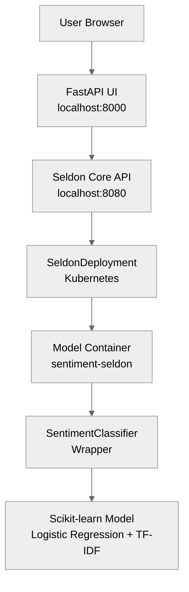

# Sentiment Analyzer with Seldon Core v1

[](https://github.com/r39132/learn-seldon-core-v1/actions/workflows/ci.yml)
[](https://www.python.org/downloads/)
[](https://github.com/SeldonIO/seldon-core)
[](https://github.com/psf/black)
[](https://opensource.org/licenses/Apache-2.0)

A production-ready ML project demonstrating three-class sentiment analysis (Positive/Neutral/Negative) with model training, deployment, and serving using **Seldon Core v1** on Kubernetes.

> **⚠️ Educational Purpose**: The sentiment analysis model is intentionally simple (Logistic Regression with TF-IDF) to focus on Seldon Core v1 deployment patterns rather than state-of-the-art NLP.

## Table of Contents

- [Overview](#overview)
- [Development, Testing, & Deployment](#development-testing--deployment)
  - [Prerequisites](#prerequisites)
  - [Setup](#setup)
  - [Quick Start](#quick-start)
  - [Project Structure](#project-structure)
- [Commands](#commands)
- [Architecture](#architecture)
- [Documentation](#documentation)
This project demonstrates:
- **Model Training**: Scikit-learn pipeline with TF-IDF vectorization
- **Model Serving**: Seldon Core v1 on Kubernetes with custom Python wrapper
- **Web Interface**: FastAPI UI for interactive sentiment analysis
- **Modern Tooling**: pyenv, direnv, uv for reproducible environments
- **Best Practices**: Type hints, testing, linting, pre-commit hooks

### Features

- ✅ **Three-class sentiment** (Positive/Neutral/Negative) with confidence scores
- ✅ **Seldon Core v1** production-grade model serving
- ✅ **FastAPI UI** for easy interaction
- ✅ **Complete automation** via Makefiles
- ✅ **Kubernetes deployment** on minikube
- ✅ **Jupyter notebooks** for interactive exploration


## Development, Testing, & Deployment

### Prerequisites

- **macOS** (or Linux/WSL2)
- **Homebrew** installed
- **4GB+ RAM** for Kubernetes
- **Docker Desktop** (for K8s deployment)

All development tools (Python, Java, pyenv, jenv, direnv, uv) are installed automatically.

### Setup
Refer to [SETUP.md](docs/SETUP.md)

### Quick Start

Refer [QUICKSTART.md](docs/QUICKSTART.md)


### Project Structure

```
learn-seldon-core-v1/
├── src/
│   ├── app.py                  # FastAPI UI application
│   ├── seldon_model.py         # Seldon Core v1 wrapper
│   ├── train_model.py          # Model training script
│   └── generate_data.py        # Training data generator
├── k8s/
│   └── seldon-deployment.yaml  # Seldon Core v1 CRD
├── notebooks/
│   ├── 01_train_model.ipynb    # Training workflow
│   └── 02_inference_test.ipynb # Testing predictions
├── models/                      # Trained model artifacts
├── data/                        # Training datasets
└── tests/                       # Unit tests
```

### 📂 Important Files

| File | Purpose |
|------|---------|
| `.env` | Environment variables |
| `pyproject.toml` | Dependencies and config |
| `src/app.py` | FastAPI UI application |
| `src/seldon_model.py` | Seldon Core v1 Python wrapper |
| `src/train_model.py` | Model training |
| `models/sentiment_model.pkl` | Trained model |
| `k8s/seldon-deployment.yaml` | Seldon Core v1 deployment |
| `.s2i/environment` | Seldon s2i configuration |

## Commands

**Development:**
```bash
make data                      # Generate training data
make train                     # Train model
make notebook                  # Start Jupyter notebook
make clean-build-artifacts     # Clean caches
```

**Kubernetes Deployment:**
```bash
make k8s-deploy-model-server   # Deploy model server
make k8s-ms-status             # Check deployment status
make k8s-ms-port-fwd           # Port forward service (terminal 1)
make k8s-ms-test               # Test model server (terminal 2)
make k8s-ms-logs               # Stream logs
make k8s-clean                 # Delete all resources
```

**Local UI:**
```bash
make run-ui                    # Start UI server
make stop-ui                   # Stop UI server
```

**All commands:** Run `make help`

## Architecture

### Model Serving Flow



**Key Components:**

- **Seldon Core v1** - Model serving framework with CRD-based deployment
- **SeldonDeployment** - Kubernetes custom resource defining inference graph
- **Service Orchestrator** - Request routing and model execution
- **SentimentClassifier** - Python wrapper implementing Seldon API
- **FastAPI UI** - Web interface for user interaction

**Model Architecture:**
- Logistic Regression classifier
- TF-IDF vectorization (5000 features, 1-5 n-grams)
- Three sentiment classes: Positive, Neutral, Negative

## Documentation

| Document | Description |
|----------|-------------|
| [QUICKSTART.md](docs/QUICKSTART.md) | Get started in 5 minutes |
| [SETUP.md](docs/SETUP.md) | Detailed setup instructions |
| [TROUBLESHOOTING.md](docs/TROUBLESHOOTING.md) | Common issues and solutions |
| [ARCHITECTURE.md](docs/ARCHITECTURE.md) | System design and architecture |


---

**Built with:** Seldon Core v1.17.1 • FastAPI • Scikit-learn • Kubernetes • Python 3.12
